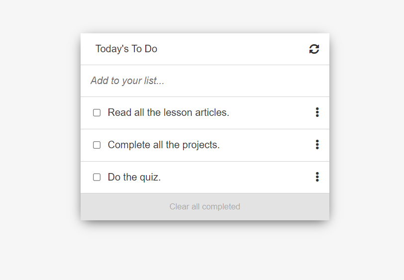

# Awesome books: plain JavaScript with objects

## 📗 Table of Contents

- [📖 Overview](#about-project)
  - [Project Objectives](#project-objectives)
  - [🛠 Built With](#built-with)
    - [Tech Stack](#tech-stack)
    - [Key Features](#key-features)
  - [🚀 Live Demo](#live-demo)
    - [Screenshots](#screenshots)
- [💻 Getting Started](#getting-started)
  - [Setup](#setup)
  - [Prerequisites](#prerequisites)
  - [Install](#install)
  - [Run tests](#run-tests)
  - [Deployment](#deployment)
- [👥 Authors](#authors)
- [🔭 Future Features](#future-features)
- [🤝 Contributing](#contributing)
- [⭐️ Show your support](#support)
- [🙏 Acknowledgements](#acknowledgements)
- [📝 License](#license)

## 📖 Overview 

# To Do list

> Using HTML, CSS, JavaScriptsm, Npm and Webpack.

### Project Objectives 

- [x] Use webpack to bundle JavaScript.
- [x] Use proper ES6 syntax.
- [x] Use ES6 modules to write modular JavaScript.
- [x] Create a dynamic to do lists form JavaScript array object.
- [x] Create a style using a given template.
- [x] Use local storage for keeping the todo list.
- [x] Use Tasks module for doing CRUD operations.

## 🛠 Built With 

### Tech Stack 

- [HTML](https://developer.mozilla.org/en-US/docs/Web/HTML)
- [JavaScript](https://developer.mozilla.org/en-US/docs/Web/JavaScript)
- [CSS](https://developer.mozilla.org/en-US/docs/Web/CSS)
- [npm](#)
- [webpack](#)

### Key Features 

- [x] Creates a todo list page from a given template
- [x] Use ES6 Standard

## 🚀 Live Demo 

After cloning the project into directory, you can run:

### `npm run start`

Runs the app in the development mode.\
Open [http://localhost:8080](http://localhost:8080) to view it in the browser.

### Screenshots 

<h3 align="center">Screenshot</h3>

  

## 💻 Getting Started 

- [Optional] Install git bash to your machine to enable you to clone this repo.
- install Visual Studio to be able to host a local live version.
- Install a browser to view the local live version.

To get a local copy up and running follow these simple example steps.

### Setup 

- Open your GitHub account the repository's [link](https://github.com/yosaddis/todo-list)

### Prerequisites 

- Internet connection
- A github account

### Install 

- copy the repo's link and clone it by writing `git clone https://github.com/yosaddis/todo-list.git` on your git bash terminal.
- `npm install` to install the dependencies

### Run tests 

- You can check for errors by running linter tests found in the github flows.

### Deployment 

### `npm run start`

Runs the app in the development mode.\
Open [http://localhost:8080](http://localhost:8080) to view it in the browser.

## Authors 

👤 Yoseph Addisu

- [GitHub](https://github.com/yosaddis)
- [LinkedIn](https://www.linkedin.com/in/yoseph-addisu-79a58b60)

## 🤝 Contributing 

Contributions, issues, and feature requests are welcome!

Feel free to check the [issues page](../../issues/).

## ⭐️ Show your suppor 

Give a ⭐️ if you like this project!

## 📝 License 

This project is [MIT](./LICENSE) licensed.
